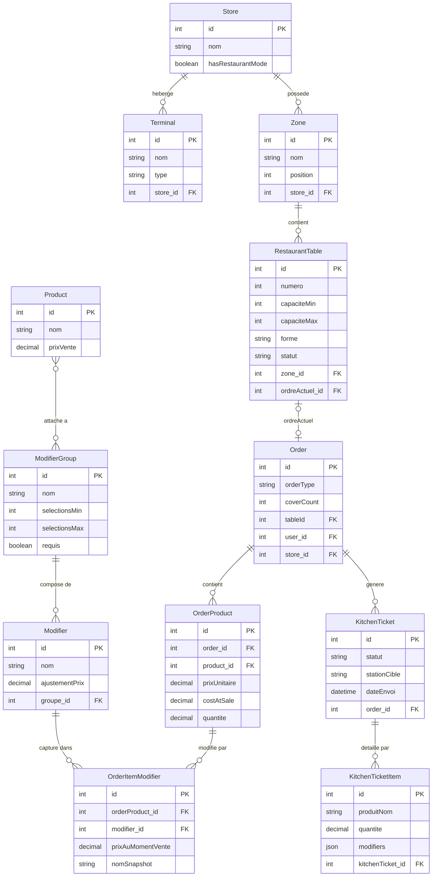
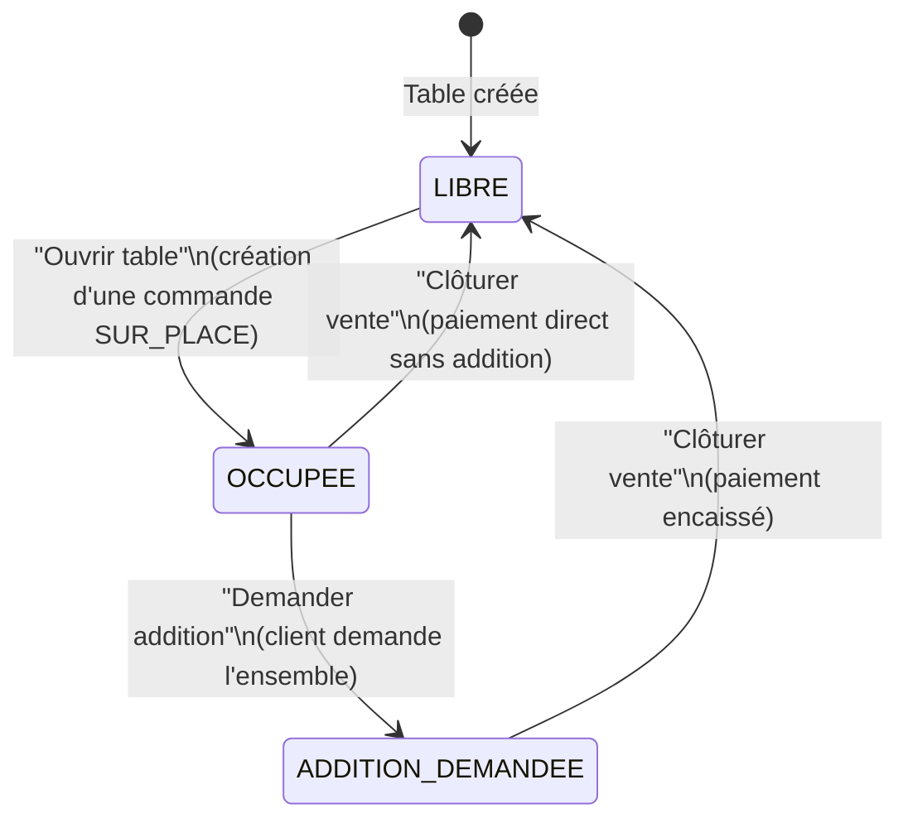
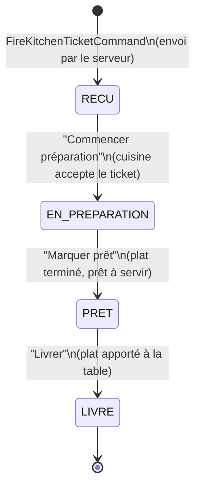
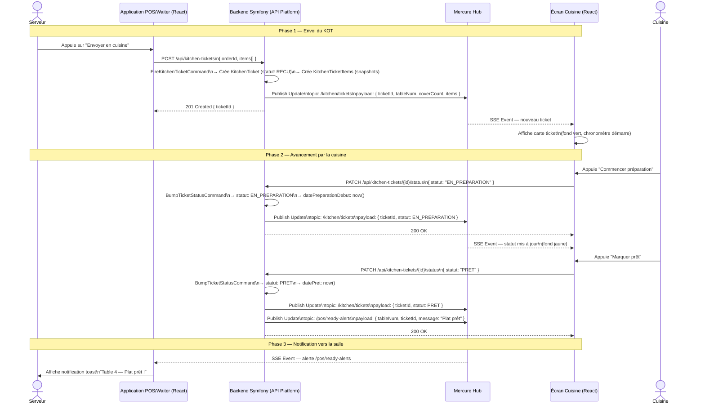

# Extension Restaurant de VelociPOS — Document Technique
## المطعم

> **Version :** 1.0 — Document de conception (sans implémentation)
> **Date :** 2026-02-19
> **Auteur :** Conception technique — Phase 8
> **Langue :** Français (en-têtes de section bilingues FR / AR)

---

## 1. Introduction et Périmètre / مقدمة ونطاق

### 1.1 Objectif du document

Ce document constitue la spécification technique de l'extension restaurant de **VelociPOS**, un système de point de vente conçu pour les boutiques, restaurants et cafés en Mauritanie. Il décrit, à un niveau de conception, la manière dont le système existant serait enrichi pour gérer des opérations propres à la restauration : gestion des tables, système de modifiers, flux de commande cuisine (KOT) et écran cuisine (KDS).

Ce document est destiné à une présentation académique et à une évaluation technique. Il constitue une spécification de conception, non un guide d'implémentation. Aucun code source (PHP, TypeScript ou SQL) n'est inclus ; seuls les modèles de données, les flux fonctionnels, les interfaces utilisateur et les diagrammes d'architecture sont présentés.

### 1.2 Périmètre fonctionnel

**Ce document couvre :**

| Module | Description |
|--------|-------------|
| Gestion des tables | Zones, tables, statuts, cycle de vie, fusion |
| Système de modifiers | GroupeModifier / Modifier, affectation produits, capture commande |
| Flux de commande cuisine (KOT) | Envoi, cycle de vie du ticket, routage par station |
| Écran cuisine (KDS) | Affichage temps-réel, code couleur, notifications |

**Ce document ne couvre pas (hors périmètre) :**

- L'implémentation du code source (PHP, TypeScript, SQL)
- Le déploiement en production ou la configuration serveur
- Un éditeur graphique de plan de salle avec glisser-déposer
- La gestion des réservations ou des files d'attente
- Les modules de comptabilité avancée ou de paie

### 1.3 Architecture de référence

VelociPOS est construit sur la pile technologique suivante, sur laquelle s'appuie l'extension restaurant :

| Couche | Technologie |
|--------|-------------|
| Backend | Symfony 5.4 + API Platform 2.x |
| ORM | Doctrine ORM (MariaDB) |
| Frontend | React 18 + Vite + TailwindCSS |
| Temps-réel | Mercure SSE (Symfony ecosystem) |
| Auth | JWT (LexikJWTAuthenticationBundle) |
| Internationalisation | i18next (FR / AR, support RTL) |
| Monnaie | MRU (Ouguiya mauritanien) |

L'extension restaurant s'intègre à cette pile sans remplacer aucun composant existant. Les entités `Order`, `OrderProduct`, `Store`, `Terminal`, `Product` et `User` sont étendues par ajout de champs et de nouvelles entités liées.

---

## 2. Extension du Modèle de Données / توسيع نموذج البيانات

### 2.1 Entités existantes modifiées

L'extension restaurant enrichit quatre entités existantes sans modifier leur comportement de base. Les colonnes ajoutées sont toutes nullables afin de garantir une compatibilité totale avec les magasins n'activant pas le mode restaurant.

#### Entité `Store` — ajout du flag de mode restaurant

| Champ ajouté | Type | Valeur par défaut | Description |
|---|---|---|---|
| `hasRestaurantMode` | `boolean` | `false` | Active/désactive les fonctionnalités restaurant pour ce magasin |

Quand `hasRestaurantMode = false`, l'interface POS et l'API se comportent exactement comme avant l'extension. Le flag permet une activation progressive et une migration non-destructive.

#### Entité `Terminal` — type de terminal

| Champ ajouté | Type | Valeur par défaut | Description |
|---|---|---|---|
| `type` | `enum('POS', 'KDS', 'WAITER')` | `'POS'` | Détermine le rôle du terminal dans la salle et en cuisine |

Un terminal `KDS` affiche uniquement l'écran cuisine. Un terminal `WAITER` est une tablette de service en salle. Un terminal `POS` est la caisse classique.

#### Entité `Order` — extension pour le service en salle

| Champ ajouté | Type | Nullable | Description |
|---|---|---|---|
| `tableId` | `integer FK → RestaurantTable` | oui | Table associée à cette commande |
| `coverCount` | `integer` | oui | Nombre de couverts (clients) à la table |
| `orderType` | `enum('EMPORTER', 'SUR_PLACE')` | non | Type de service (par défaut `EMPORTER`) |

Une commande `SUR_PLACE` est liée à une table (`tableId` non null, `coverCount` ≥ 1). Une commande `EMPORTER` conserve le comportement actuel (pas de table, pas de couverts).

#### Entité `OrderProduct` — référence aux modifiers sélectionnés

L'entité `OrderProduct` existante acquiert une collection d'entités `OrderItemModifier` via une relation OneToMany. Aucun champ scalaire n'est ajouté sur `OrderProduct` lui-même ; la relation est gérée par l'ORM.

### 2.2 Nouvelles entités

#### Zone

Une zone représente une section géographique du restaurant (ex : Salle principale, Terrasse, Bar).

| Champ | Type | Contraintes | Description |
|---|---|---|---|
| `id` | `integer` | PK, auto-increment | Identifiant unique |
| `store` | `Store` | ManyToOne, NOT NULL | Magasin auquel appartient la zone |
| `nom` | `string(100)` | NOT NULL | Nom affiché de la zone |
| `position` | `integer` | NOT NULL, default 0 | Ordre d'affichage |
| `isActif` | `boolean` | NOT NULL, default true | Visibilité dans l'interface |
| `createdAt` | `datetime` | auto | Date de création |
| `updatedAt` | `datetime` | auto | Date de dernière modification |

#### RestaurantTable

Une table physique appartenant à une zone, avec son statut courant.

| Champ | Type | Contraintes | Description |
|---|---|---|---|
| `id` | `integer` | PK, auto-increment | Identifiant unique |
| `zone` | `Zone` | ManyToOne, NOT NULL | Zone parente |
| `numero` | `integer` | NOT NULL | Numéro affiché en salle |
| `capaciteMin` | `integer` | NOT NULL, default 1 | Nombre minimum de couverts |
| `capaciteMax` | `integer` | NOT NULL | Nombre maximum de couverts |
| `forme` | `enum('RONDE','CARREE','RECTANGULAIRE')` | NOT NULL | Forme de la table |
| `statut` | `enum('LIBRE','OCCUPEE','ADDITION_DEMANDEE')` | NOT NULL, default `LIBRE` | Statut courant |
| `ordreActuel` | `Order` | OneToOne, nullable | Commande en cours sur cette table |
| `createdAt` | `datetime` | auto | Date de création |
| `updatedAt` | `datetime` | auto | Date de dernière modification |

#### ModifierGroup

Un groupe de modifiers associé à un ou plusieurs produits (ex : groupe "Cuisson" pour les viandes).

| Champ | Type | Contraintes | Description |
|---|---|---|---|
| `id` | `integer` | PK, auto-increment | Identifiant unique |
| `nom` | `string(150)` | NOT NULL | Nom du groupe (ex : "Cuisson", "Suppléments") |
| `selectionsMin` | `integer` | NOT NULL, default 0 | Nombre minimum de choix (0 = optionnel) |
| `selectionsMax` | `integer` | nullable | Nombre maximum de choix (null = illimité) |
| `requis` | `boolean` | NOT NULL, default false | Le serveur doit sélectionner au moins `selectionsMin` |
| `produits` | `Product[]` | ManyToMany | Produits auxquels ce groupe est attaché |

#### Modifier

Un choix individuel au sein d'un ModifierGroup.

| Champ | Type | Contraintes | Description |
|---|---|---|---|
| `id` | `integer` | PK, auto-increment | Identifiant unique |
| `groupe` | `ModifierGroup` | ManyToOne, NOT NULL | Groupe parent |
| `nom` | `string(150)` | NOT NULL | Nom affiché (ex : "Saignant", "À point", "Bien cuit") |
| `ajustementPrix` | `decimal(10,2)` | NOT NULL, default 0.00 | Ajustement de prix en MRU (peut être 0, positif ou négatif) |
| `isActif` | `boolean` | NOT NULL, default true | Désactivation sans suppression |

#### OrderItemModifier

Capture immuable des modifiers sélectionnés pour un article de commande. Suit le même patron d'instantané que `costAtSale` sur `OrderProduct` (Phase 2 du projet).

| Champ | Type | Contraintes | Description |
|---|---|---|---|
| `id` | `integer` | PK, auto-increment | Identifiant unique |
| `orderProduct` | `OrderProduct` | ManyToOne, NOT NULL | Article de commande parent |
| `modifier` | `Modifier` | ManyToOne, NOT NULL | Modifier sélectionné |
| `prixAuMomentVente` | `decimal(10,2)` | NOT NULL | Snapshot du prix au moment de la vente |
| `nomSnapshot` | `string(150)` | NOT NULL | Snapshot du nom (survit aux renommages) |

#### KitchenTicket

Un bon de commande cuisine (KOT) déclenché lors de l'envoi explicite d'une commande en cuisine.

| Champ | Type | Contraintes | Description |
|---|---|---|---|
| `id` | `integer` | PK, auto-increment | Identifiant unique |
| `order` | `Order` | ManyToOne, NOT NULL | Commande source |
| `statut` | `enum('RECU','EN_PREPARATION','PRET','LIVRE')` | NOT NULL, default `RECU` | Statut courant du ticket |
| `stationCible` | `string(100)` | nullable | Station cuisine cible (ex : "Grill", "Froid", "Bar") |
| `dateEnvoi` | `datetime` | NOT NULL | Horodatage de l'envoi par le serveur |
| `datePreparationDebut` | `datetime` | nullable | Horodatage du début de préparation |
| `datePret` | `datetime` | nullable | Horodatage de la mise à disposition |
| `dateLivraison` | `datetime` | nullable | Horodatage de la livraison au client |
| `items` | `KitchenTicketItem[]` | OneToMany | Articles du ticket (snapshot) |

#### KitchenTicketItem

Snapshot d'un article au moment de l'envoi en cuisine, avec ses modifiers dénormalisés.

| Champ | Type | Contraintes | Description |
|---|---|---|---|
| `id` | `integer` | PK, auto-increment | Identifiant unique |
| `kitchenTicket` | `KitchenTicket` | ManyToOne, NOT NULL | Ticket parent |
| `produitNom` | `string(200)` | NOT NULL | Nom du produit au moment de l'envoi |
| `quantite` | `decimal(10,2)` | NOT NULL | Quantité commandée |
| `modifiers` | `json` | NOT NULL | Liste des modifiers formatés (ex : `["Cuisson: À point", "Sans oignon"]`) |

### 2.3 Diagramme entité-relation



---

## 3. Gestion des Tables / إدارة الطاولات

### 3.1 Zones et plan de salle

Le restaurant est organisé en **zones** : des sections nommées regroupant un ensemble de tables physiques. Chaque zone appartient à un magasin (`Store`) et peut être activée ou désactivée indépendamment.

**Exemples de zones :**
- Salle principale (tables 1 à 20)
- Terrasse (tables 21 à 30)
- Bar (tables 31 à 35)
- Salon privé (tables 36 à 40)

**Approche de l'interface — listes de cartes :**

L'interface de gestion des tables adopte une présentation en **listes de cartes** plutôt qu'un plan de salle graphique. Chaque table est représentée par une carte affichant son numéro, sa capacité et son statut courant avec un code couleur. Cette approche :
- Est réalisable avec la pile technique existante (React + TailwindCSS)
- Fonctionne parfaitement sur tablettes tactiles (terminal `WAITER`)
- Ne nécessite pas de librairie de rendu SVG ou de canvas

Un plan de salle graphique avec positionnement par glisser-déposer est identifié comme amélioration future possible, mais hors périmètre de ce document.

**Sélecteur de zone :** En haut de l'écran, un sélecteur d'onglets permet de basculer entre les zones. Les tables de la zone sélectionnée s'affichent en dessous sous forme de grille de cartes.

### 3.2 Cycle de vie d'une table (machine à états)

Chaque `RestaurantTable` possède un champ `statut` qui suit une machine à états finis stricte. Les transitions autorisées sont les suivantes :



**Description des états :**

| Statut | Signification | Code couleur |
|--------|---------------|--------------|
| `LIBRE` | Table vide, disponible | Vert |
| `OCCUPEE` | Table avec clients, commande ouverte | Rouge |
| `ADDITION_DEMANDEE` | Clients attendent l'addition | Orange |

**Déclencheurs des transitions :**

| Transition | Déclencheur | Acteur |
|---|---|---|
| `LIBRE → OCCUPEE` | Ouverture d'une commande `SUR_PLACE` liée à la table | Serveur ou caissier |
| `OCCUPEE → ADDITION_DEMANDEE` | Action "Demander addition" dans l'interface | Serveur |
| `ADDITION_DEMANDEE → LIBRE` | Encaissement et clôture de la commande | Caissier |
| `OCCUPEE → LIBRE` | Clôture directe sans demande d'addition préalable | Caissier |

### 3.3 Interface de gestion des tables

L'interface de gestion des tables est accessible depuis l'application `WAITER` (tablette de service) et depuis l'application `POS` (caisse) en mode restaurant.

**Composants de l'interface :**

1. **Sélecteur de zone** — barre d'onglets en haut d'écran affichant toutes les zones actives du magasin. L'onglet sélectionné détermine l'ensemble de tables affiché.

2. **Grille de cartes de tables** — chaque carte affiche :
   - Le numéro de la table (grand, lisible à distance)
   - Le statut actuel avec code couleur de fond
   - Le nombre de couverts en cours (si `OCCUPEE` ou `ADDITION_DEMANDEE`)
   - Le temps écoulé depuis l'ouverture de la table
   - La capacité maximale (discret, en bas de carte)

3. **Action sur la table** — un appui sur une carte de table ouvre un panneau latéral permettant de :
   - Saisir le nombre de couverts (si ouverture)
   - Accéder à la commande en cours (articles, modifiers)
   - Envoyer en cuisine (déclencher un KOT)
   - Demander l'addition
   - Fusionner avec une autre table
   - Clôturer et encaisser

### 3.4 Fusion de tables

La fusion de tables permet de regrouper plusieurs tables physiques pour des groupes importants (ex : réservation privée occupant les tables 5, 6 et 7).

**Mécanisme :**

- Le serveur sélectionne une table principale et ajoute des tables secondaires à la fusion
- Toutes les tables secondaires sont marquées `OCCUPEE` et leur `ordreActuel` pointe vers la même commande `Order` que la table principale
- Les articles commandés aux différentes tables sont tous ajoutés à cette commande unique
- Un seul ticket de caisse est généré à la clôture

**Dissolution de la fusion :**

- Lors de la clôture de la commande, toutes les tables impliquées dans la fusion repassent à `LIBRE`
- Aucune re-facturation individuelle par table n'est effectuée (hors périmètre)

---

## 4. Système de Modifiers / نظام الإضافات

### 4.1 Structure ModifierGroup / Modifier

Le système de modifiers repose sur une hiérarchie à deux niveaux : le **ModifierGroup** (groupe de personnalisation) et le **Modifier** (option individuelle).

**Exemple 1 — Cuisson (requis, choix unique) :**

```
ModifierGroup: "Cuisson"
  selectionsMin: 1
  selectionsMax: 1
  requis: true
  Modifiers:
    - "Saignant"       ajustementPrix: 0.00 MRU
    - "À point"        ajustementPrix: 0.00 MRU
    - "Bien cuit"      ajustementPrix: 0.00 MRU
```

**Exemple 2 — Suppléments (optionnel, plusieurs choix) :**

```
ModifierGroup: "Suppléments Pizza"
  selectionsMin: 0
  selectionsMax: 5
  requis: false
  Modifiers:
    - "Fromage extra"     ajustementPrix:  0.00 MRU
    - "Champignons"       ajustementPrix: +15.00 MRU
    - "Jambon"            ajustementPrix: +20.00 MRU
    - "Olives"            ajustementPrix: +10.00 MRU
    - "Piment"            ajustementPrix:  0.00 MRU
```

**Exemple 3 — Substitution (ajustement négatif) :**

```
ModifierGroup: "Pain"
  selectionsMin: 0
  selectionsMax: 1
  requis: false
  Modifiers:
    - "Pain complet"      ajustementPrix:  0.00 MRU
    - "Sans pain"         ajustementPrix: -10.00 MRU
```

**Modifier niveaux uniques :** Ce document décrit des modifiers à un seul niveau de profondeur (un `ModifierGroup` contient des `Modifier` plats). Les modifiers imbriqués (sous-groupes dans un groupe) constituent une extension future possible et sont hors périmètre.

### 4.2 Affectation aux produits

Un `ModifierGroup` est lié aux produits via une relation **ManyToMany** : un même groupe peut être réutilisé sur plusieurs produits, et un produit peut avoir plusieurs groupes.

**Exemples d'affectation :**

| Produit | Groupes de modifiers |
|---------|---------------------|
| Burger Classic | Cuisson, Suppléments Burger, Pain |
| Burger Végétarien | Suppléments Burger, Pain |
| Pizza Margherita | Suppléments Pizza |
| Pizza Calzone | Suppléments Pizza |
| Côte d'agneau | Cuisson |

**Interface d'administration :** L'administrateur (ROLE_MANAGER ou ROLE_ADMIN) accède à un écran de configuration des produits où il peut, pour chaque produit, sélectionner les groupes de modifiers associés depuis une liste de groupes existants, ou en créer de nouveaux.

### 4.3 Capture sur commande (OrderItemModifier)

Lorsque le serveur sélectionne des modifiers pour un article, chaque choix est enregistré comme un enregistrement `OrderItemModifier` lié à l'`OrderProduct` correspondant.

**Patron d'instantané (snapshot pattern) :** Le champ `prixAuMomentVente` copie la valeur de `ajustementPrix` au moment de la commande, et `nomSnapshot` copie le nom du modifier. Ce patron est identique à `costAtSale` sur `OrderProduct` (implémenté en Phase 2 du projet), garantissant l'immuabilité des données financières même si un modifier est renommé ou supprimé ultérieurement.

**Exemple de calcul de prix :**

```
Produit : Burger Classic          prix de base : 450 MRU
  + Modifier : "Bien cuit"        ajustement : +0 MRU
  + Modifier : "Fromage extra"    ajustement : +0 MRU
  + Modifier : "Champignons"      ajustement : +15 MRU
                                  ─────────────────────
  Prix total article : 465 MRU
```

L'ajustement total des modifiers est additionné au prix de base de l'`OrderProduct` pour obtenir le prix final de la ligne de commande.

### 4.4 Affichage sur ticket cuisine

Les modifiers sélectionnés apparaissent intégralement sur le bon de commande cuisine (KOT) affiché sur le KDS. La cuisine voit exactement ce que le serveur a saisi.

**Format d'affichage d'un ticket cuisine :**

```
═══════════════════════════════════════
  TABLE 4  |  3 couverts  |  14h32
═══════════════════════════════════════
  Burger Classic × 2
    └ Cuisson: À point
    └ Champignons
    └ Sans oignon
───────────────────────────────────────
  Pizza Margherita × 1
    └ Fromage extra
    └ Olives
───────────────────────────────────────
  Côte d'agneau × 1
    └ Cuisson: Saignant
═══════════════════════════════════════
```

Les modifiers sont affichés en retrait sous le nom du produit, avec le préfixe "└" pour une lisibilité optimale dans un environnement cuisine (lumière variable, distance de lecture).

---

## 5. Flux de Commande Cuisine (KOT) / تدفق أوامر المطبخ

### 5.1 Envoi d'un KOT

Un **KOT** (Kitchen Order Ticket — bon de commande cuisine) est le document transmis à la cuisine lorsque le serveur valide les articles à préparer. L'envoi est une action **explicite** du serveur, distincte du paiement : une table peut recevoir plusieurs KOT pendant son service (ex : entrées envoyées en premier, plats principaux envoyés séparément).

**Déclencheur :** Le serveur appuie sur "Envoyer en cuisine" dans l'interface de gestion de la table. Cette action déclenche la commande CQRS `FireKitchenTicketCommand`.

**Traitement de la commande `FireKitchenTicketCommand` :**

1. Validation des articles à envoyer (au moins un article sélectionné)
2. Création d'un enregistrement `KitchenTicket` lié à l'`Order` courant, avec statut `RECU`
3. Création d'un `KitchenTicketItem` par article, avec snapshot du nom et des modifiers formatés
4. Publication d'une mise à jour Mercure sur le topic `/kitchen/tickets` (voir Section 6.1)
5. Retour de confirmation au client React (identifiant du ticket créé)

**Un seul KOT par action d'envoi :** Chaque appui sur "Envoyer en cuisine" génère exactement un `KitchenTicket`. Si le serveur envoie les entrées puis les plats dans deux actions distinctes, deux tickets distincts sont créés pour la même commande.

### 5.2 États du KOT (machine à états)

Le `KitchenTicket` suit une machine à états linéaire, avancée uniquement par le personnel de cuisine via l'interface KDS.



**Description des états :**

| Statut | Signification | Déclencheur | Acteur |
|--------|---------------|-------------|--------|
| `RECU` | Ticket reçu en cuisine, en attente de traitement | Création du ticket | Système |
| `EN_PREPARATION` | Cuisson/préparation en cours | Bump sur KDS | Personnel cuisine |
| `PRET` | Plat terminé, prêt à être apporté | Bump sur KDS | Personnel cuisine |
| `LIVRE` | Plat apporté et servi à la table | Confirmation livraison | Serveur |

**Horodatages :** Chaque transition enregistre un horodatage dans le champ correspondant de `KitchenTicket` (`datePreparationDebut`, `datePret`, `dateLivraison`), permettant des analyses de performance cuisine (temps moyen de préparation, etc.).

La commande CQRS `BumpTicketStatusCommand` gère les transitions `RECU → EN_PREPARATION → PRET` (déclenchées sur le KDS). La commande `ConfirmDeliveryCommand` gère la transition `PRET → LIVRE` (déclenchée depuis l'interface serveur).

### 5.3 Routage par station

Dans un restaurant avec plusieurs postes de travail en cuisine (grill, friture, poste froid, bar), les articles peuvent être routés vers la station appropriée.

**Mécanisme de routage :**

- Le champ `stationCible` du `Product` (ou de la `Category` parente) indique la station vers laquelle les tickets contenant ce produit sont routés
- Un `KitchenTicket` a un unique champ `stationCible` : si une commande contient des articles de plusieurs stations, le système génère un `KitchenTicket` par station lors de l'action d'envoi

**Cas de base (configuration recommandée) :**

Pour les restaurants de petite taille ou en début d'utilisation, une configuration avec une seule station unifiée est recommandée. Tous les `KitchenTicket` n'ont pas de `stationCible` (null), et le KDS unique reçoit tous les tickets.

**Configuration avancée :**

Un restaurant avec plusieurs postes peut configurer le routage :

| Station | Exemple de produits routés |
|---------|---------------------------|
| Grill | Steaks, côtes, brochettes |
| Froid | Salades, desserts, fromages |
| Bar | Boissons, cocktails |
| Chaud | Soupes, pâtes, tajines |

Chaque KDS physique est configuré pour n'afficher que les tickets de sa station (filtrage par `stationCible` dans l'abonnement Mercure).

### 5.4 Diagramme de séquence (Waiter → Backend → KDS → Notification)



---

## 6. Écran Cuisine (KDS) / شاشة المطبخ

### 6.1 Architecture temps-réel (Mercure SSE)

Le KDS est une application React distincte s'exécutant sur un terminal de type `KDS` (tablette ou écran dédié en cuisine). La communication en temps-réel repose sur **Mercure SSE** (Server-Sent Events), déjà présent dans l'écosystème Symfony du projet.

**Mécanisme Publish/Subscribe :**

| Composant | Rôle |
|-----------|------|
| Backend Symfony | Éditeur (publisher) — publie des mises à jour Mercure lors de chaque changement de statut |
| Mercure Hub | Broker SSE — reçoit les publications et les diffuse aux abonnés |
| Application KDS (React) | Abonné (subscriber) — maintient une connexion `EventSource` ouverte vers le hub Mercure |
| Application POS/Waiter | Abonné — souscrit au topic `/pos/ready-alerts` pour les notifications "plat prêt" |

**Topics Mercure utilisés :**

| Topic | Éditeur | Abonnés | Payload |
|-------|---------|---------|---------|
| `/kitchen/tickets` | Backend (sur création et changement de statut de ticket) | Tous les KDS actifs | `{ ticketId, tableNum, coverCount, statut, items, stationCible }` |
| `/pos/ready-alerts` | Backend (sur passage à statut `PRET`) | Applications POS et WAITER | `{ ticketId, tableNum, message }` |

**Avantage de Mercure vs polling :** Le KDS reçoit chaque nouveau ticket et chaque changement de statut en temps-réel, sans interrogation périodique du serveur. La latence typique est inférieure à 500ms, indépendamment du nombre de terminaux connectés.

### 6.2 Interface de l'écran cuisine

L'écran cuisine affiche les tickets actifs sous forme de **cartes chronologiques** : les tickets les plus anciens (non traités) apparaissent en premier.

**Structure d'une carte de ticket :**

```
┌─────────────────────────────────────────┐
│  TABLE 4              [RECU]  ● 00:03   │
│  3 couverts                             │
├─────────────────────────────────────────┤
│  Burger Classic × 2                     │
│    └ Cuisson: À point                   │
│    └ Champignons                        │
├─────────────────────────────────────────┤
│  Pizza Margherita × 1                   │
│    └ Fromage extra                      │
├─────────────────────────────────────────┤
│            [  COMMENCER  ]              │
└─────────────────────────────────────────┘
```

**Éléments de la carte :**
- **En-tête :** numéro de table, statut actuel, chronomètre (temps écoulé depuis envoi)
- **Nombre de couverts :** affiché sous le numéro de table
- **Articles :** nom du produit, quantité, modifiers en retrait
- **Bouton d'action :** correspond à la prochaine transition disponible ("Commencer", "Marquer prêt", "Livré")

**Disposition de l'écran :**
- Grille de cartes, 2 à 4 colonnes selon la taille de l'écran
- Cartes triées par `dateEnvoi` ascendant (le plus ancien ticket en haut à gauche)
- Scroll vertical si plus de tickets que l'écran ne peut en afficher

### 6.3 Code couleur et alertes visuelles

Le fond de chaque carte change de couleur selon le statut et le temps écoulé :

| Condition | Couleur | Signification |
|-----------|---------|---------------|
| Statut `RECU`, < seuil | Vert | Nouveau ticket, dans les délais |
| Statut `RECU`, > seuil configuré | Rouge vif | Ticket non pris en charge depuis trop longtemps |
| Statut `EN_PREPARATION` | Jaune | Préparation en cours |
| Statut `PRET` | Bleu | Prêt à être servi (en attente de livraison) |
| Statut `LIVRE` | Gris (masqué) | Ticket archivé, retiré de l'écran après confirmation |

**Seuil d'alerte configurable :** Un paramètre `delaiAlerteMinutes` (configurable par le ROLE_MANAGER dans les paramètres du magasin) définit le temps au-delà duquel un ticket non pris en charge passe en rouge vif. Valeur recommandée : 10 minutes.

**Chronomètre par carte :** Chaque carte affiche le temps écoulé depuis `dateEnvoi`, mis à jour chaque seconde côté client. Cela permet à la cuisine d'identifier immédiatement les commandes urgentes sans lire les horodatages.

### 6.4 Notification "Plat prêt" vers la salle

Lorsqu'un ticket passe au statut `PRET`, le backend publie simultanément sur le topic Mercure `/pos/ready-alerts`. Les applications POS et WAITER, abonnées à ce topic, affichent immédiatement une **notification toast** non bloquante :

**Format de la notification :**
```
┌──────────────────────────────────┐
│  ✓  Table 4 — Plat prêt !        │
│     Burger Classic × 2           │
│     Pizza Margherita × 1         │
└──────────────────────────────────┘
```

La notification s'affiche 5 secondes puis disparaît automatiquement. Elle peut être dispensée manuellement en appuyant dessus. Une sonnerie sonore optionnelle peut accompagner la notification (configuration par le ROLE_MANAGER).

**Plusieurs notifications simultanées :** Si plusieurs tables ont un plat prêt au même moment, les notifications s'empilent verticalement dans le coin de l'écran, sans se remplacer.

---

## 7. Considérations d'Implémentation Future / اعتبارات التنفيذ المستقبلي

### 7.1 Migration de base de données

L'extension restaurant est conçue pour ne provoquer aucune rupture de compatibilité avec les données et le code existants.

**Stratégie de migration :**

| Type de changement | Impact | Réversibilité |
|---|---|---|
| Nouvelles tables (Zone, RestaurantTable, ModifierGroup, Modifier, OrderItemModifier, KitchenTicket, KitchenTicketItem) | Aucun impact — ajout pur | Suppression des tables |
| Nouvelles colonnes nullables sur `Order` (tableId, coverCount, orderType) | Aucun impact — valeur null par défaut pour les commandes existantes | Suppression des colonnes |
| Nouvelle colonne sur `Store` (hasRestaurantMode) | Aucun impact — false par défaut | Suppression de la colonne |
| Nouvelle colonne sur `Terminal` (type) | Aucun impact — 'POS' par défaut | Suppression de la colonne |

Une migration Doctrine unique, exécutée via la commande `doctrine:migrations:migrate`, applique tous ces changements sans interruption de service pour les magasins non-restaurant.

### 7.2 Activation par magasin (feature flag)

Le champ `Store.hasRestaurantMode` joue le rôle de **feature flag** permettant une activation progressive du mode restaurant, magasin par magasin.

**Comportement selon le flag :**

| `hasRestaurantMode` | Comportement |
|---------------------|-------------|
| `false` (défaut) | Interface POS classique — aucun menu table, aucun KOT, aucun KDS |
| `true` | Interface étendue — sélecteur de zones, gestion des tables, envoi KOT, écran KDS |

**Modification depuis l'interface d'administration :** Seul le `ROLE_ADMIN` peut activer ou désactiver le mode restaurant pour un magasin (via l'interface d'administration des magasins). Le changement prend effet immédiatement sans redémarrage.

**Migration progressive :** Un réseau de magasins peut activer le mode restaurant sur un site pilote avant de le déployer sur les autres magasins, sans aucune modification de code.

### 7.3 Impact sur les rapports existants

Les rapports existants (Z-Report, rapport de ventes, rapport de rentabilité, rapport par vendeur, rapport par catégorie) ne nécessitent aucune modification pour intégrer les commandes restaurant.

**Raison :** Les commandes restaurant sont des `Order` standard avec des `OrderProduct` standard. Les champs additionnels (`tableId`, `coverCount`, `orderType`) sont des métadonnées ne participant pas aux calculs financiers existants.

| Rapport existant | Comportement avec commandes restaurant |
|---|---|
| Z-Report | Inclut automatiquement les ventes SUR_PLACE dans le total — aucun changement |
| Rapport de ventes journalières | Inclut les commandes SUR_PLACE et EMPORTER sans distinction (filtrage par orderType possible en extension future) |
| Rapport de rentabilité (bénéfice = prix vente - PMP) | Identique — PMP calculé sur OrderProduct.costAtSale, non affecté par les modifiers |
| Rapport par vendeur | Les commandes SUR_PLACE sont attribuées au serveur (Order.user) — comportement identique |
| Rapport par catégorie | OrderProduct.product.categories — identique, non affecté par l'extension |

**Extension future des rapports :** Des rapports spécifiques restaurant peuvent être ajoutés sans modification des rapports existants : temps moyen de préparation par plat, taux d'occupation des tables, revenu par zone, revenu par couvert. Ces rapports exploiteraient les horodatages `KitchenTicket` et le champ `coverCount` de `Order`.

---

## Annexe A — Endpoints API Platform (hypothétiques)

Les endpoints suivants seraient exposés par API Platform via l'extension restaurant. Ils suivent les conventions REST déjà établies dans le projet (préfixe `/api`, format JSON:LD, sécurisation par JWT).

| Méthode | Endpoint | Description | Rôle minimum |
|---------|----------|-------------|-------------|
| `GET` | `/api/zones` | Liste des zones d'un magasin | ROLE_VENDEUR |
| `POST` | `/api/zones` | Créer une zone | ROLE_MANAGER |
| `GET` | `/api/restaurant-tables` | Liste des tables avec statut courant | ROLE_VENDEUR |
| `PATCH` | `/api/restaurant-tables/{id}/status` | Mettre à jour le statut d'une table | ROLE_VENDEUR |
| `GET` | `/api/modifier-groups` | Liste des groupes de modifiers (filtrable par produit) | ROLE_VENDEUR |
| `POST` | `/api/kitchen-tickets` | Envoyer un KOT en cuisine | ROLE_VENDEUR |
| `GET` | `/api/kitchen-tickets` | Lister les tickets actifs (sondage, Mercure préféré) | ROLE_VENDEUR |
| `PATCH` | `/api/kitchen-tickets/{id}/status` | Avancer le statut d'un ticket (bump) | ROLE_VENDEUR |

---

## Annexe B — Extension des Permissions (RBAC)

L'extension restaurant étend les Voters Symfony existants pour couvrir les nouvelles opérations. La hiérarchie de rôles existante (`ROLE_VENDEUR < ROLE_MANAGER < ROLE_ADMIN`) est conservée.

| Opération | ROLE_VENDEUR | ROLE_MANAGER | ROLE_ADMIN |
|-----------|:---:|:---:|:---:|
| Ouvrir / clôturer une table | Oui | Oui | Oui |
| Envoyer un KOT en cuisine | Oui | Oui | Oui |
| Consulter l'écran KDS | Oui | Oui | Oui |
| Bump du statut d'un ticket KDS | Oui | Oui | Oui |
| Configurer zones et tables | Non | Oui | Oui |
| Créer / modifier des ModifierGroups | Non | Oui | Oui |
| Affecter des modifiers aux produits | Non | Oui | Oui |
| Activer / désactiver le mode restaurant | Non | Non | Oui |
| Configurer le seuil d'alerte KDS | Non | Oui | Oui |

---

## Annexe C — Glossaire

| Terme | Définition |
|-------|------------|
| **KOT** | Kitchen Order Ticket — bon de commande transmis à la cuisine |
| **KDS** | Kitchen Display Screen — écran cuisine remplaçant l'imprimante de tickets |
| **Bump** | Action d'avancer le statut d'un ticket KDS d'un état au suivant |
| **Cover** | Couvert — un client assis à une table |
| **SSE** | Server-Sent Events — protocole de communication unidirectionnelle serveur → client |
| **Mercure** | Protocole et hub open-source basé sur SSE, intégré à l'écosystème Symfony |
| **MRU** | Ouguiya mauritanien — devise utilisée dans VelociPOS |
| **PMP** | Prix Moyen Pondéré — méthode de valorisation des stocks utilisée dans VelociPOS |
| **CQRS** | Command Query Responsibility Segregation — patron architectural séparant les commandes des requêtes |
| **Feature flag** | Indicateur booléen permettant d'activer/désactiver une fonctionnalité sans déploiement |

---

*Document technique — Extension Restaurant de VelociPOS*
*Phase 8 — VelociPOS Pointe de Vente*
*Mauritanie — Système POS bilingue FR/AR*
